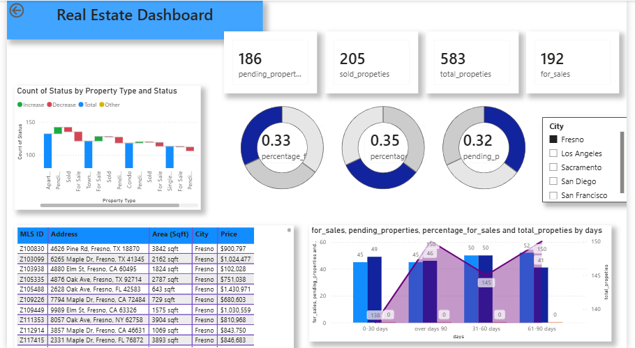

# 🏠 Real Estate Analytics Dashboard

An interactive **Real Estate Analytics Dashboard** developed using **Microsoft Excel and Power BI** to analyze property sales, pending properties, property types, prices, cities, and sales performance.

## 📊 Dashboard Preview

## 🛠️ Tools & Technologies

- Microsoft Excel
- Power BI
- Data Cleaning
- Data Analysis
- Data Visualization
- Business Intelligence

## 🎯 Project Objectives

- Analyze real estate property data.
- Track sold, pending, and available properties.
- Analyze property types and their status.
- Compare properties across different cities.
- Analyze property prices and area.
- Understand property selling duration.
- Present insights through an interactive Power BI dashboard.

## 📌 Key KPIs

The dashboard includes:

- Total Properties
- Sold Properties
- Pending Properties
- Properties for Sale
- Property Status Percentage
- Property Type Analysis
- City-wise Property Analysis
- Property Price Analysis
- Sales Duration Analysis

## 📈 Dashboard Features

### Property Status Analysis
Visualizes the distribution of properties based on their status, including **Sold, Pending, and For Sale**.

### Property Type Analysis
Analyzes property status across different property types.

### City-wise Analysis
Interactive city filtering allows users to explore property data for different locations.

### Sales Duration Analysis
Analyzes properties based on the number of days they remain on the market.

### Property Details
The dashboard provides detailed information including:

- MLS ID
- Address
- Area (Sqft)
- City
- Price

## 💡 Key Insights

The dashboard helps users understand:

- Property availability and sales status.
- Distribution of properties across cities.
- Property-type-wise sales trends.
- Properties remaining on the market for longer periods.
- Property price and area information.

## 🚀 Future Scope

- Add property price prediction using Machine Learning.
- Add geographical/map-based analysis.
- Add automated data refresh.
- Include time-series sales analysis.
- Develop predictive analytics for property sales.

## 📁 Project Files

| File | Description |
|------|-------------|
| `real estate Dashboard.pbit` | Power BI dashboard template |
| `Real Estate.xlsx` | Real estate dataset |
| `real estate dashboard ss.png` | Dashboard preview |

## 👩‍💻 Author

**Isha Pradhan**

B.Tech – Computer Science & Engineering (AI & ML)

## ⭐ Project Category

**Data Analytics | Business Intelligence | Power BI | Excel**
